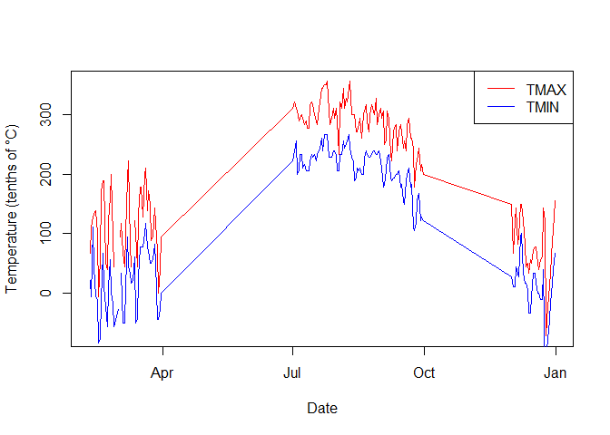

<!-- README.md is generated from README.Rmd. Please edit that file -->

# ghcn

<!-- badges: start -->

<!-- badges: end -->

The `ghcn` package provides a streamlined interface for accessing and
analyzing Global Historical Climatology Network - Daily (GHCN-D) data
hosted on Amazon Web Services (AWS). By leveraging the AWS-hosted GHCN-D
dataset, this package enables researchers and data scientists to quickly
access vast amounts of historical climate data without worrying about
API rate limits or complex query constructions. Whether you’re
conducting large-scale climate studies, analyzing local weather
patterns, or integrating climate data into broader research projects,
`ghcn` provides a user-friendly and efficient toolset for exploring and
utilizing GHCN-D data.

## Installation

### pak

You can install the development version of ghcn from
[GitHub](https://github.com/) with:

``` r
# install.packages("pak")
pak::pak("joshbrinks/ghcn")
```

### Cloning the repository

If you want to clone the repository and install the package locally,
follow these steps:

1.  Clone the repository:

        git clone https://github.com/yourusername/ghcn.git

2.  Open R or RStudio and set your working directory to the cloned
    repository:

    ``` r
    setwd("path/to/ghcn")
    ```

3.  Install the package:

    ``` r
    devtools::install()
    ```

### Development version

To install the development version of the package, you can use:

``` r
remotes::install_github("yourusername/ghcn@develop")
```

This will install the latest version from the `develop` branch.

After installation, you can load the package using:

``` r
library(ghcn)
```

## Example

Here’s a quick example of how to use the main functions in the `ghcn`
package:

``` r
library(ghcn)

# Find weather stations near New York City
nyc_stations <- find_stations_aws(lat = 40.7128, lon = -74.0060, radius = 50)

# Get inventory for the first station
inventory <- get_inventory_aws(nyc_stations$id[1])

# Fetch temperature data for 2022
data <- get_data_aws(
  station_id = nyc_stations$id[1],
  start_date = "2022-01-01",
  end_date = "2022-12-31",
  variables = c("TMAX", "TMIN")
)

# Basic plot of the data
plot(data$DATE, data$TMAX, type = "l", col = "red", 
     xlab = "Date", ylab = "Temperature (tenths of °C)")
lines(data$DATE, data$TMIN, col = "blue")
legend("topright", legend = c("TMAX", "TMIN"), col = c("red", "blue"), lty = 1)
```



For more detailed examples and usage, please refer to the package
vignettes.
